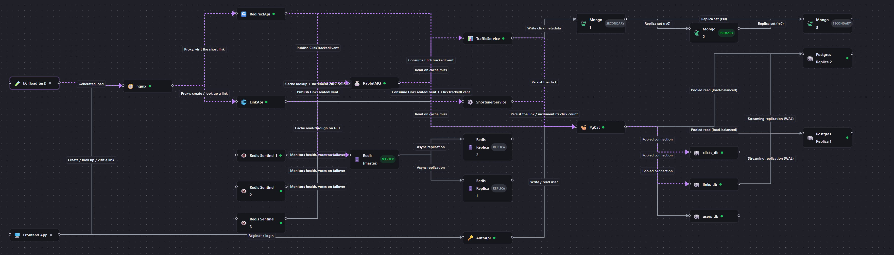
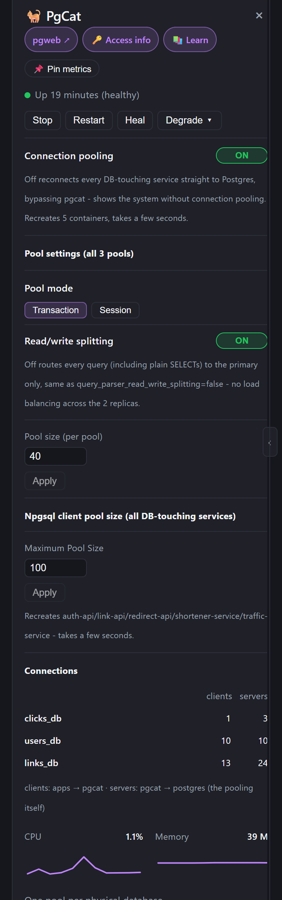
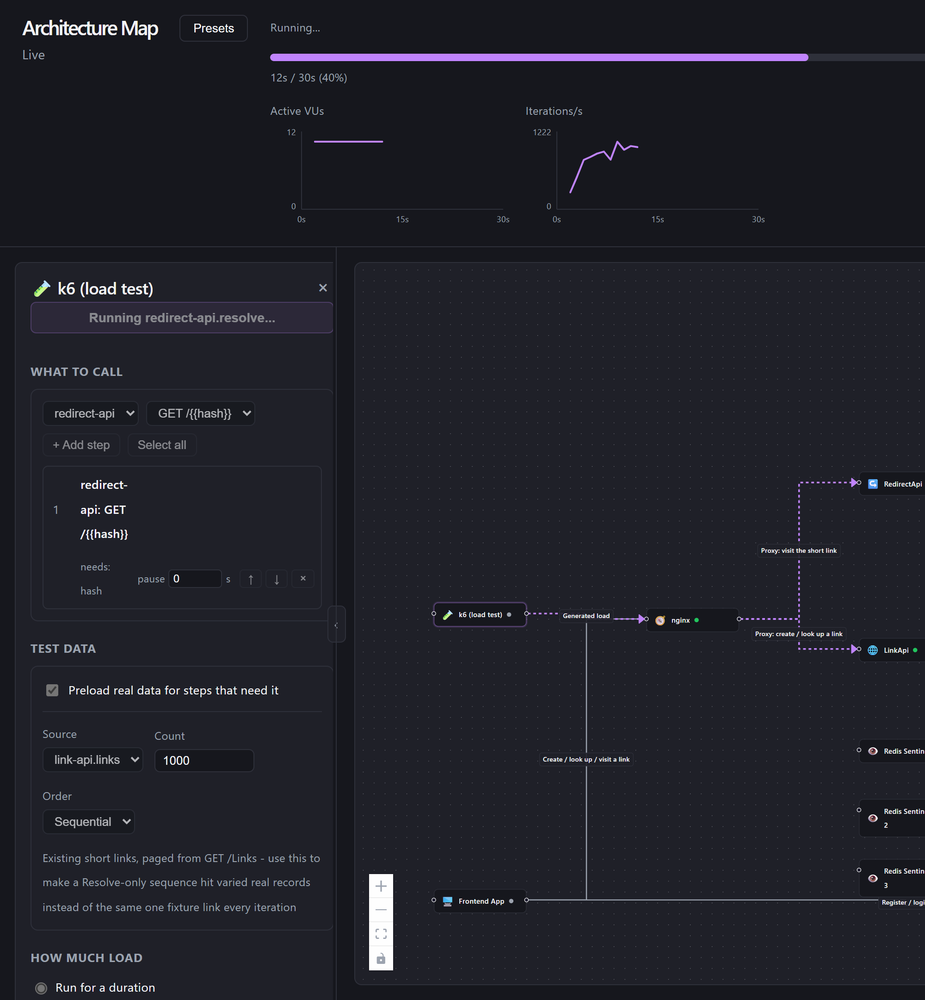
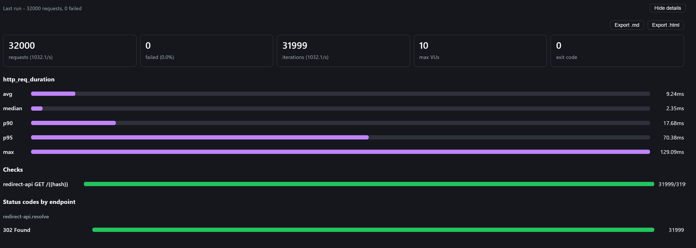
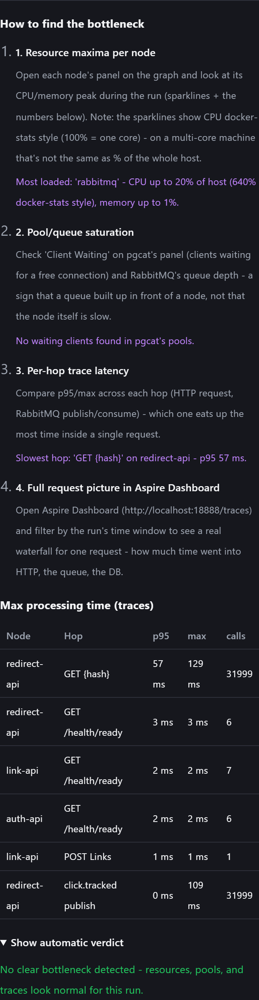
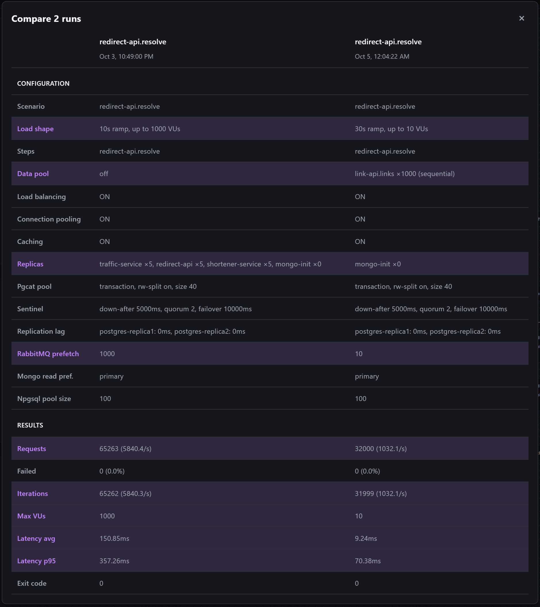
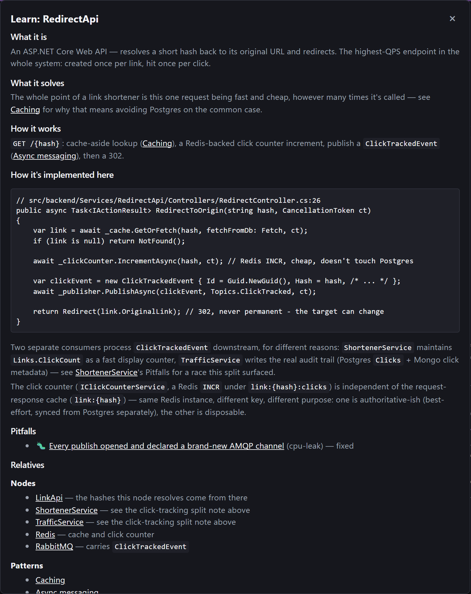
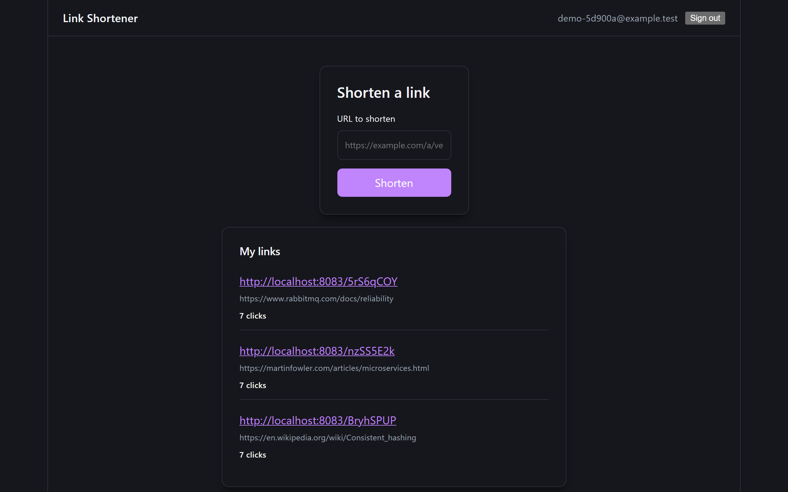
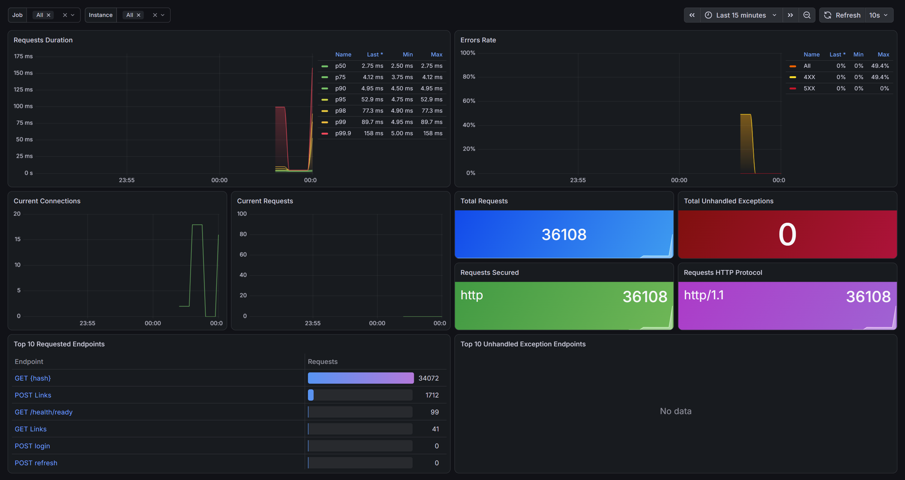
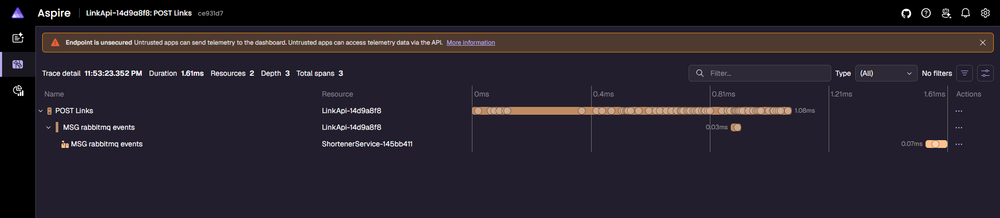

<p align="center">
  <picture>
    <source media="(prefers-color-scheme: dark)" srcset="docs/images/logo-dark.svg">
    
  </picture>
</p>

# Link Shortener — a high-load patterns playground

An **educational project** built around a deliberately simple product — a link shortener — whose
real purpose is to let you study the patterns and solutions used when designing high-load systems:
caching, async messaging, read replicas, data retention/partitioning, connection pooling, failover,
observability.

The product stays small on purpose. Around it sits a set of independent high-load patterns you can
build, toggle and observe live — not a fixed sequence to climb, but a stand you configure.

> **A note on the solutions shown here.** Everything in this repository is an *example* of how a
> given pattern can be applied — not a claim that it is the only correct way, or even the best one
> for your case. Trade-offs, alternatives and the mistakes made along the way are part of the
> material; treat the code as a starting point for discussion, not a reference implementation.

## Agenda

New to the project? Start with the **[User Guide](sandbox/docs/user-guide.md)** — a complete
walkthrough of the sandbox.

- [What makes this project different](#what-makes-this-project-different)
- [A look inside](#a-look-inside)
- [Patterns](#patterns)
- [Tech stack](#tech-stack)
- [Requirements](#requirements)
- [Quick start](#quick-start)
- [Documentation](#documentation)

## What makes this project different

- **A sandbox with a live architecture diagram.** The whole running system is drawn as an
  interactive graph. Click any node (a service, a database, a queue, a cache, a proxy) to see its
  details, live metrics and controls.
- **Built-in load testing.** Run k6 scenarios against the stack straight from the sandbox UI,
  configure traffic profiles, compare runs and watch the bottleneck move as you change the system.
- **Report analysis and bottleneck hunting.** Every run is saved with the infrastructure settings
  it ran under. You can compare runs side by side, and a guided checklist walks you through finding
  the bottleneck — CPU/memory peaks per node, pool and queue saturation, per-hop trace latency —
  with an optional automatic verdict.
- **Chaos and tuning controls.** Stop, restart, degrade or scale containers, resize connection
  pools, fail over Redis, change replication lag — and see what the system does about it.
- **A real product frontend.** A working UI (register, log in, create a short link, view click
  stats) that you can test by hand, so you can feel what the load tests are doing to a real user.
- **Explanation cards for every component.** Each node has a "Learn" card: what it is, what role it
  plays in the system, and — importantly — **what can go wrong** when you build it, with
  before/after code from real bugs found in this repository.

## A look inside

*Click any image to open it at full resolution.*

### The interactive architecture map

The whole running system as a live graph. Dashed purple lines are traffic flowing right now.



### Node panels: details, metrics and controls

Every node has its own panel — status, CPU/memory, start/stop/degrade, plus component-specific
controls (here: pgcat pooling mode, read/write splitting, pool sizes, live connection counts).



### Built-in load testing

Pick the endpoints to hit, preload real data, shape the load profile and run it — with live
VU and iteration charts while the graph animates.



### Test report

Every run produces a report: throughput, failures, latency percentiles, checks and status codes.
Reports can be exported as Markdown or HTML, and past runs can be compared.



### Analyzing a run and finding the bottleneck

A finished run is a saved snapshot: the scenario, the load shape and the state of the infrastructure
at that moment (replicas, pool sizes, caching, prefetch, ...). Two things help you make sense of it:

- **Guided bottleneck search.** A four-step checklist — resource maxima per node, pool/queue
  saturation, per-hop trace latency, the full request waterfall in the tracing UI — with the
  findings for *this* run filled in, plus a table of the slowest hops taken from traces. An
  automatic verdict is available behind a click, deliberately collapsed so that you can try to find
  the culprit yourself first.



- **Run comparison.** Tick any two runs and compare them: the rows that differ (load shape, replicas,
  prefetch, ...) are highlighted next to the resulting throughput and latency — which makes "what
  did changing X actually do?" a one-glance answer.



### Explanation cards

A "Learn" card per component: what it is, what it solves, how it is implemented here (with code),
and the pitfalls hit along the way.



### The product's own frontend

A real UI you can test by hand: register, shorten a link, watch the click counter grow.



### Observability

Dashboards in Grafana (`-Observability Full`)...



...or traces in the Aspire Dashboard (default), following a request across the RabbitMQ boundary
from LinkApi to ShortenerService.



## Patterns

The stand is one complete, configurable system, not a staircase of numbered scenarios — every
pattern below is already live in the running stack and can be toggled/observed independently.

| Pattern | What it is | Status |
|---|---|---|
| Caching | Redis, read-through on link lookups | Built |
| Async processing | RabbitMQ between the APIs and their workers | Built |
| Read replicas | Postgres primary + 2 streaming replicas, PgCat routes reads vs writes | Built |
| High availability / failover | Postgres + Mongo replica sets, Redis Sentinel | Built |
| CQRS reporting | ClickHouse as a third, independent read model off the same click events | Built |
| Sync ⇄ async messaging toggle | Swap RabbitMQ for direct gRPC calls, live, to feel the coupling cost | Built |
| Data retention (partitioning) | Postgres native partitioning + Mongo/ClickHouse TTLs for `clicks` | Built — maintenance job still open |
| Pooler scaling | 3 PgCat instances behind an HAProxy TCP load balancer | Built |

Pattern write-ups (what it is, what it solves, how it works) are in
[`sandbox/docs/scenarios/patterns/`](sandbox/docs/scenarios/patterns/), per-component notes in
[`sandbox/docs/scenarios/nodes/`](sandbox/docs/scenarios/nodes/), and real bugs found while
building these in [`sandbox/docs/scenarios/pitfalls/`](sandbox/docs/scenarios/pitfalls/); the
target architecture and current implementation status are in
[`sandbox/docs/architecture.md`](sandbox/docs/architecture.md).

## Tech stack

| Area | Technologies |
|---|---|
| Backend | .NET 10, ASP.NET Core, EF Core, xUnit |
| Product frontend | React 19, TypeScript, Vite, React Router |
| Sandbox frontend | React 19, TypeScript, Vite, React Flow (`@xyflow/react`), SignalR |
| Data | PostgreSQL 16 (partitioned), MongoDB 7 (replica set), ClickHouse, Redis 7 (+ Sentinel), SQLite (fallback queue) |
| Messaging | RabbitMQ (⇄ gRPC, toggleable) |
| Infrastructure | Docker Compose, nginx, pgcat (connection pooling) |
| Load & chaos | k6, Pumba |
| Observability | OpenTelemetry, Aspire Dashboard — or Prometheus, Jaeger, Loki, Grafana |

## Requirements

- **Docker Desktop** (or Docker Engine with the Compose plugin), running.
- **Node.js** — a version supported by Vite 8 (20.19+ or 22.12+) — and npm, for the two frontends.
- **PowerShell** (Windows PowerShell or PowerShell 7+) or **bash** to run the helper scripts under
  `sandbox/scripts/` — each one has a `.ps1` and a `.sh` version with the same flags/prompts.
- **Free RAM / CPU:** the stack runs a few dozen containers (databases, replicas, Sentinel, Mongo
  replica set, five .NET services, exporters). Plan for roughly **16 GB of RAM** available to
  Docker, more if you enable the full observability stack and run load tests.
  *(This is a rough guideline, not a measured minimum.)*
- The **.NET SDK is only needed if you want to build or test the backend outside Docker**; the
  stack builds its images inside containers.

## Quick start

```powershell
# from the repository root (Windows)
sandbox\scripts\start-stack.ps1
```

```bash
# from the repository root (Linux/macOS)
./sandbox/scripts/start-stack.sh
```

The script starts the backend via Docker Compose, installs frontend dependencies on first run,
launches both frontend dev servers and opens them in the browser. Anything not passed as a flag is
asked interactively: which observability stack to use (`Full` — Prometheus/Jaeger/Loki/Grafana — by
default, `Aspire` for a lighter dashboard, or `None`), and whether to start each browser UI
(Postgres/Redis/Mongo/SQLite fallback-queue/RabbitMQ) and the product frontend (all default to yes).

Once it is up:

| What | URL |
|---|---|
| Product frontend | http://localhost:5173 |
| Sandbox architecture map | http://localhost:5174 |
| AuthApi / LinkApi / RedirectApi docs (Scalar) | http://localhost:8081/scalar/v1 · :8082 · :8083 |
| RabbitMQ UI | http://localhost:15672 (`guest` / `guest`) |
| pgweb (Postgres) | http://localhost:8084 |
| RedisInsight | http://localhost:5540 |
| Mongo Express | http://localhost:8085 |
| SQLite fallback-queue viewers (LinkApi / RedirectApi) | http://localhost:8086 · :8087 |
| Aspire Dashboard | http://localhost:18888 |
| Grafana, Prometheus, Jaeger (`Full`, the default) | http://localhost:3000 · :9090 · :16686 |

Useful variants (PowerShell; the `.sh` scripts take the same options as `--kebab-case` flags, e.g.
`--build`, `--observability Full`, `--wipe`):

```powershell
sandbox\scripts\start-stack.ps1 -Build                         # rebuild backend images after .NET code changes
sandbox\scripts\start-stack.ps1 -SkipFrontend                  # backend only
sandbox\scripts\start-stack.ps1 -Observability None            # skip otel-collector/aspire-dashboard entirely
sandbox\scripts\start-stack.ps1 -SkipPostgresUi -SkipMongoUi    # skip pgweb and Mongo Express
sandbox\scripts\stop-stack.ps1                                 # stop everything
sandbox\scripts\stop-stack.ps1 -Wipe                            # also drop the Postgres volume
```

**Where to go first:** open the product frontend, create a link and click it; then open the
architecture map, click through the nodes, and start a small load test.

## Documentation

- [Repository map](docs/repository-map.md) — how the repository is laid out and why.
- [`sandbox/docs/`](sandbox/docs/) — node and pattern explanations, pitfalls.
- [`src/docs/`](src/docs/) — documentation of the product's own code (API shapes, DB schema).
- [User Guide](sandbox/docs/user-guide.md) — a complete, screenshot-led walkthrough of the sandbox.
