# Sandbox User Guide

> A screenshot walkthrough of everything the `sandbox/` learning harness gives you: the scripts
> that start/stop it, the product app, the architecture-map control plane, every infrastructure
> browser UI, and the observability stack. For *why* each pattern exists and the mechanics behind
> it, see [`architecture.md`](architecture.md) and [`scenarios/`](scenarios/) — this guide is about
> *using* the sandbox, not the theory behind it.
>
> Don't confuse the two frontends: `src/frontend/app` is **the product** (the thing an end user of
> a link shortener would actually use). `sandbox/frontend/architecture-map` is **the sandbox's own
> control panel** — a second, separate app for driving and observing the stack. Both are covered
> below.

## Contents

1. [Starting and stopping the stack](#1-starting-and-stopping-the-stack)
2. [What's running, and on which port](#2-whats-running-and-on-which-port)
3. [The product app](#3-the-product-app)
4. [The architecture map](#4-the-architecture-map)
   - [4.1 Layout](#41-layout)
   - [4.2 Reading the graph](#42-reading-the-graph)
   - [4.3 The node panel and generic controls](#43-the-node-panel-and-generic-controls)
   - [4.4 Chaos: Degrade / Heal](#44-chaos-degrade--heal)
   - [4.5 Scaling a service](#45-scaling-a-service)
   - [4.6 Component-specific controls](#46-component-specific-controls)
   - [4.7 Connections (edges)](#47-connections-edges)
   - [4.8 Access info and Learn](#48-access-info-and-learn)
   - [4.9 Pinned metrics](#49-pinned-metrics)
   - [4.10 Load testing with k6](#410-load-testing-with-k6)
   - [4.11 Run history, reuse, and compare](#411-run-history-reuse-and-compare)
   - [4.12 Presets](#412-presets)
5. [Infrastructure browser UIs](#5-infrastructure-browser-uis)
6. [Observability](#6-observability)
7. [API docs (Scalar)](#7-api-docs-scalar)
8. [Database dump / restore](#8-database-dump--restore)
9. [A worked example, start to finish](#9-a-worked-example-start-to-finish)
10. [Where to go next](#10-where-to-go-next)

---

## 1. Starting and stopping the stack

Everything lives under `sandbox/scripts/`. Each `.ps1` (Windows) has a `.sh` twin (Linux/macOS)
with the same flags, kebab-cased (`-SkipMongoUi` → `--skip-mongo-ui`).

```powershell
sandbox\scripts\start-stack.ps1
```

Run with no flags, it's interactive: it asks which **observability** tier to route telemetry to,
and whether to start each optional browser UI (pgweb, RedisInsight, Mongo Express, the two
sqlite-web fallback-queue viewers, the RabbitMQ management UI) and the product frontend. Every
question defaults to **yes** on Enter. Useful flags to skip the prompts:

| Flag | What it does |
|---|---|
| `-Build` | Rebuild backend Docker images first (after changing .NET code) |
| `-Observability Full \| Aspire \| None` | Telemetry sink — see [§6](#6-observability) |
| `-SkipFrontend` | Don't launch *either* frontend dev server |
| `-SkipProductUi` | Skip only the product app (`src/frontend/app`); architecture-map still starts — it's the panel you drive everything else from |
| `-SkipPostgresUi` / `-SkipRedisUi` / `-SkipMongoUi` / `-SkipSqliteUi` / `-SkipRabbitMqUi` | Skip one optional browser UI |
| `-NoBrowser` | Don't auto-open a browser tab once the frontends are up |

The first run also copies two gitignored config files from their `.example` templates:
`sandbox/infra/pgcat/pgcat.toml` (rewritten live by the PgCat pool-settings control — see
[§4.6](#46-component-specific-controls) — so it can't be tracked as-is) and each frontend's
`.env.local`. If you run `docker compose up` by hand instead of the script, copy those yourself
first.

```powershell
sandbox\scripts\stop-stack.ps1            # backend down, Postgres volume kept
sandbox\scripts\stop-stack.ps1 -Wipe      # also drops the Postgres volume (fresh DB next start)
```

`stop-stack` always tears down every optional profile (observability, each UI), regardless of
which ones the run that started them actually used — so it never leaves an orphaned container
behind from an earlier run with different flags.

Manually, from `sandbox/`: `docker compose --profile ui-postgres --profile ui-redis ... up -d` —
each optional piece is its own Compose profile (`otel`, `observability`, `ui-postgres`, `ui-redis`,
`ui-mongo`, `ui-sqlite`); see `docker-compose.yml` for the full list.

---

## 2. What's running, and on which port

| Component | Port | Always on? |
|---|---|---|
| Product app (`src/frontend/app`) | 5173 | unless `-SkipProductUi` |
| Architecture map (control plane) | 5174 | unless `-SkipFrontend` |
| AuthApi / LinkApi / RedirectApi (Scalar docs at `/scalar/v1`) | 8081 / 8082 / 8083 | yes |
| nginx (fronts LinkApi/RedirectApi for load balancing) | 8082 / 8083 | yes |
| Postgres primary / replica 1 / replica 2 | 5432 / 5433 / 5434 | yes |
| PgCat (pooler) | 6432 | yes |
| Redis master (via Sentinels, not dialed directly) | 6379 | yes |
| Redis Sentinels 1 / 2 / 3 | 26379 / 26380 / 26381 | yes |
| RabbitMQ (AMQP / management UI) | 5672 / 15672 | UI: unless `-SkipRabbitMqUi` |
| Mongo 1 / 2 / 3 (replica set `rs0`) | 27017 / 27018 / 27019 | yes |
| control-api (drives everything above) | 127.0.0.1:5299 | yes |
| pgweb | 8084 | unless `-SkipPostgresUi` |
| RedisInsight | 5540 | unless `-SkipRedisUi` |
| Mongo Express | 8085 | unless `-SkipMongoUi` |
| LinkApi / RedirectApi fallback-queue viewers (sqlite-web) | 8086 / 8087 | unless `-SkipSqliteUi` |
| Aspire Dashboard | 18888 | `-Observability Aspire` (or `Full`, idle) |
| Grafana / Prometheus / Jaeger / Loki | 3000 / 9090 / 16686 / 3100 | `-Observability Full` |

`control-api` is bound to `127.0.0.1` only, not every interface — it holds the Docker socket
(root-equivalent control over the whole stack) with no authentication on top, so it's reachable
only from the machine running it.

---

## 3. The product app

This is "the product" — what you'd actually deploy. Three things it can do:

**Shorten a link**, anonymously or signed in:

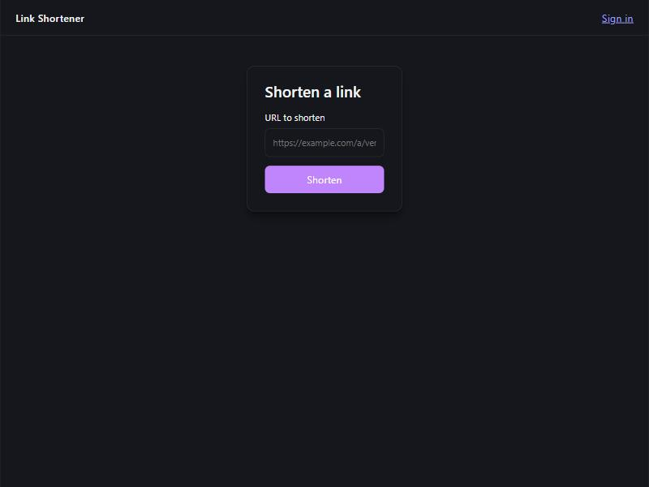

After submitting, the short link appears immediately together with a note that creation is
asynchronous — `LinkApi` returns synchronously, but `ShortenerService` persists the row a moment
later off a RabbitMQ event, so visiting the link *immediately* can occasionally 404 for a few
milliseconds:

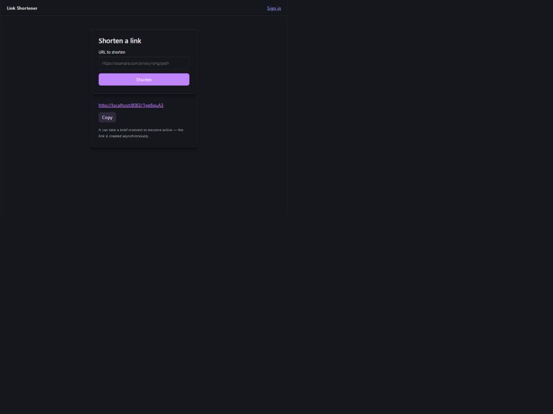

**Register / sign in** — a JWT is issued and stored client-side; no token is ever required to
create a link (`userId` just stays empty on it):

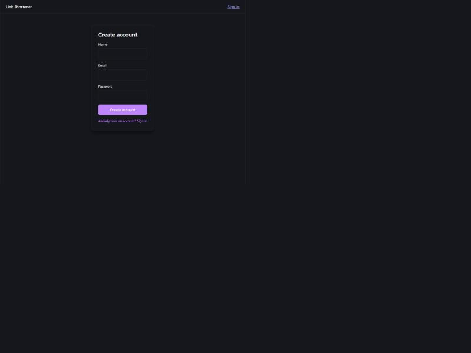

**My links**, once signed in — every link you've created, with a **Stats** button per link:

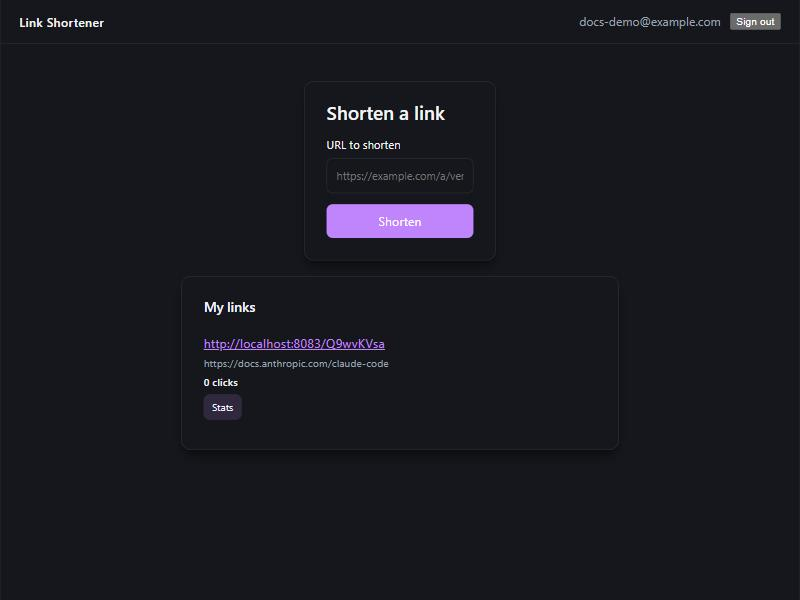

Opening Stats pulls from the click-tracking pipeline (`RedirectApi` → RabbitMQ → `TrafficService`
→ Postgres + Mongo): total clicks, a by-day breakdown, and top countries/devices parsed from the
User-Agent and geo-IP:

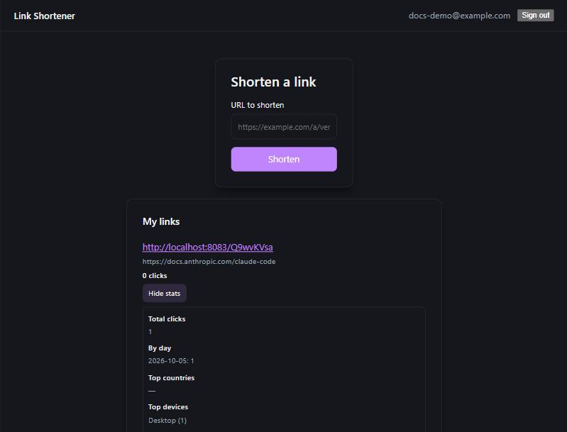

---

## 4. The architecture map

Open `http://localhost:5174`. This is the sandbox's own control plane: a live graph of every
container, with a panel per node for inspecting it, controlling it, injecting chaos into it, and —
separately — a load-testing tool for driving traffic through the whole stack and analyzing the
result.

### 4.1 Layout

Three fixed zones: a header (title, connection status, a **Presets** button, and a strip showing
the current/last load-test run), a resizable **left sidebar** whose content depends entirely on
what's selected, and the **graph** itself in the center, with a metrics overlay that can float on
top of it.

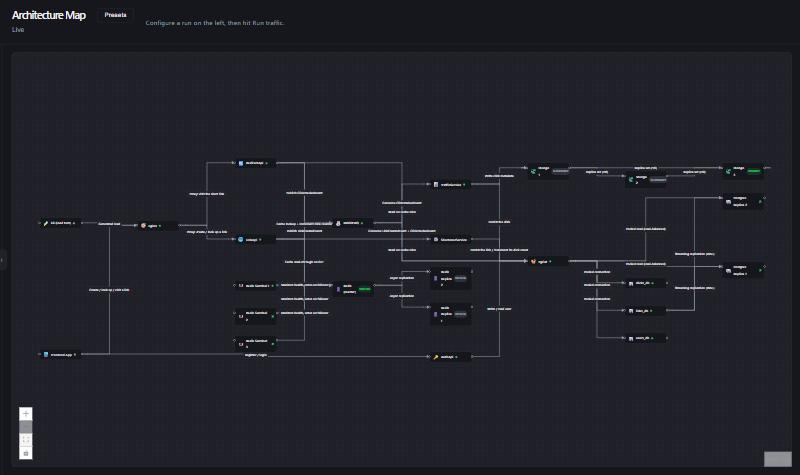

The sidebar shows exactly one of: **run history** (nothing selected — the default), the **k6
config panel** (the k6 node selected), a **node panel** (any other node), or a **connection
detail** panel (an edge selected). Selecting anything expands the sidebar if it was collapsed.

### 4.2 Reading the graph

Node positions come from an automatic layout (dagre), not hand-placed coordinates, so the exact
arrangement can shift slightly between loads — the topology itself doesn't. Each node shows an
icon, a status dot, a replica-count badge if scaled past 1, and — for Redis/Mongo — a live
role badge (`MASTER`/`REPLICA`, `PRIMARY`/`SECONDARY`), since those roles can change on failover
independently of the node's static id. Click a node to open its panel; click an edge (the
connection between two nodes) to see what that connection is for.

### 4.3 The node panel and generic controls

Every container gets the same four buttons for free, straight off Docker — nothing to configure
per node for these:

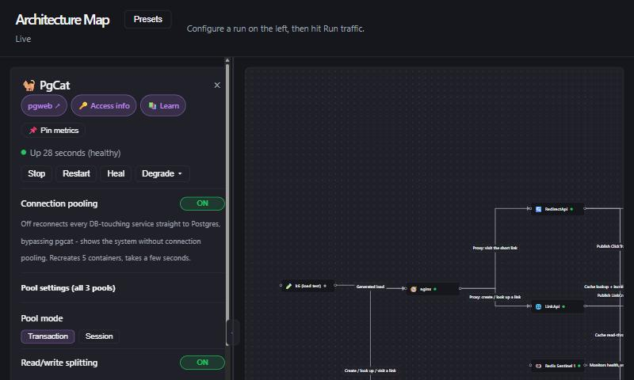

- **Start / Stop** — one button whose label flips with current state.
- **Restart** — straightforward container restart.
- **Heal** — reverses an active chaos injection on this service early (see [§4.4](#44-chaos-degrade--heal)).
- **Degrade** — opens the chaos sub-panel.

Below that: a **Pin metrics** toggle (adds this node's live CPU/RAM to the floating overlay — see
[§4.9](#49-pinned-metrics)), instance status, then any capability-specific controls this node
declares (see [§4.6](#46-component-specific-controls)), small per-instance CPU/Memory sparklines
if history exists, and finally a static **details card** pulled straight from
`architecture.json` — purpose, technologies, port, and links to the relevant config/code:

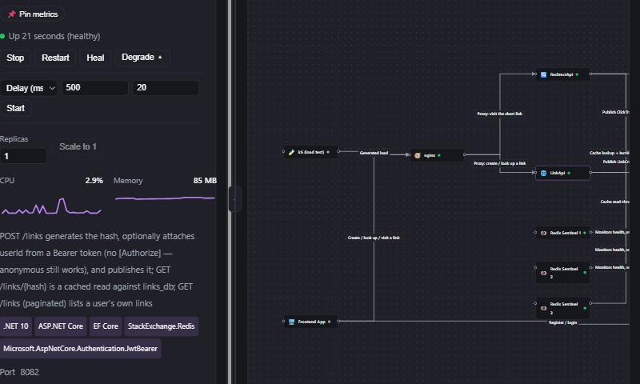

A node with no controllable container (e.g. a database considered as a logical entity rather than
a container) just shows the details card.

### 4.4 Chaos: Degrade / Heal

Clicking **Degrade** expands a small form: pick a chaos type (**Delay** in ms, **Loss** as a
percentage, or **Partition** — 100% loss), an amount, and a duration in seconds, then **Start**:

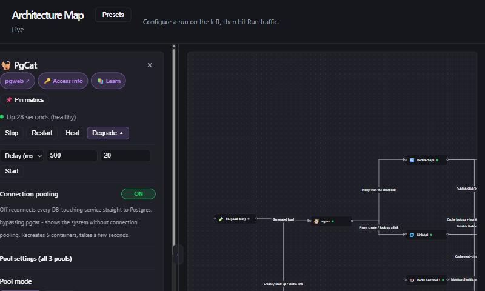

Under the hood this spins up a throwaway [Pumba](https://github.com/alexei-led/pumba) container
that runs `pumba netem` against the target container's network namespace for the given duration,
then reverts automatically. **Heal** stops that Pumba container early if you don't want to wait out
the timer. This is the sandbox's way of answering "what does a slow/flaky dependency actually do to
the rest of the system" — degrade PgCat, Redis, RabbitMQ, or any service, then watch the graph,
the metrics, and a k6 run react.

### 4.5 Scaling a service

Any node whose component declares the `scalable` capability (LinkApi, RedirectApi,
ShortenerService, TrafficService) gets a **Replicas** field and a **Scale to N** button — visible
in the LinkApi screenshot above. Scaling above 20 replicas asks for confirmation first (resource
exhaustion on a laptop-class Docker host is a real risk); the backend caps it at 100 regardless.
nginx re-resolves `link-api`/`redirect-api`'s DNS on a short TTL, so new replicas start receiving
traffic without a config reload.

### 4.6 Component-specific controls

These are declared per node in `architecture.json`'s `capabilities` array and rendered
automatically — see [`adding-a-component.md`](adding-a-component.md) if you want to add a new one.
Here's what each one actually does, grouped by the node that carries it.

**PgCat** — four capabilities on one node:

- *Connection pooling* (toggle) — off reconnects every DB-touching service straight to Postgres,
  bypassing PgCat entirely, to demonstrate the system *without* pooling. Recreates 5 containers.
- *Pool settings* — pool mode (Transaction/Session), read/write splitting on/off, and pool size per
  logical database — all three pools (`users_db`/`links_db`/`clicks_db`) at once. Hot-reloaded by
  PgCat itself in ~15s, no container recreate.
- *Npgsql client pool size* — the **client-side** pool (distinct from PgCat's own server-side one),
  across every DB-touching service. Recreates those 5 services.
- *Connections* — a read-only table, polled every 3s, of client vs. server connection counts per
  pool (`clients: apps → pgcat`, `servers: pgcat → postgres`).

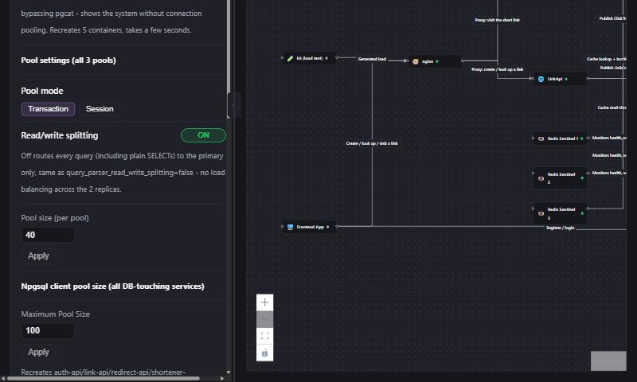

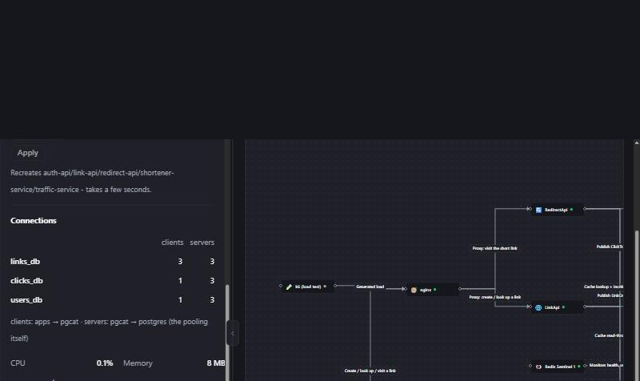

**Redis (master)** — caching toggle and a manual flush:

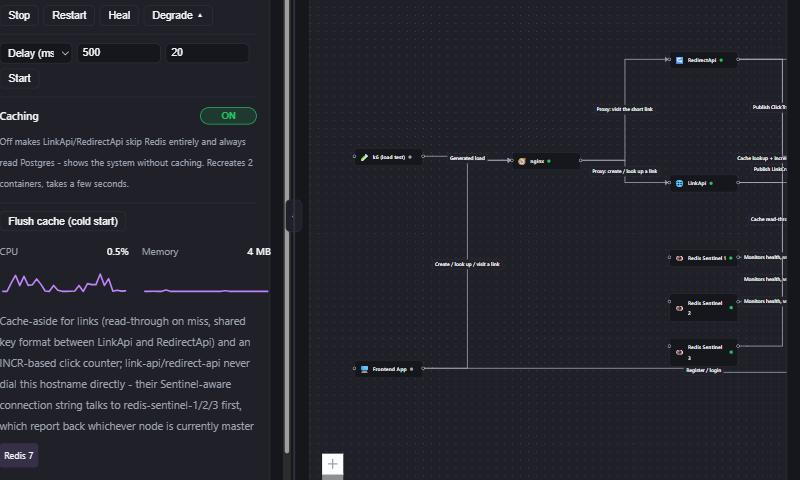

Turning caching off makes LinkApi/RedirectApi always hit Postgres directly (recreates 2
containers) — useful for seeing what the system looks like *without* the cache pattern at all.
**Flush cache** just empties Redis, simulating a cold start under load.

**Redis Sentinels** — failover tuning, shared across all three Sentinel containers at once:

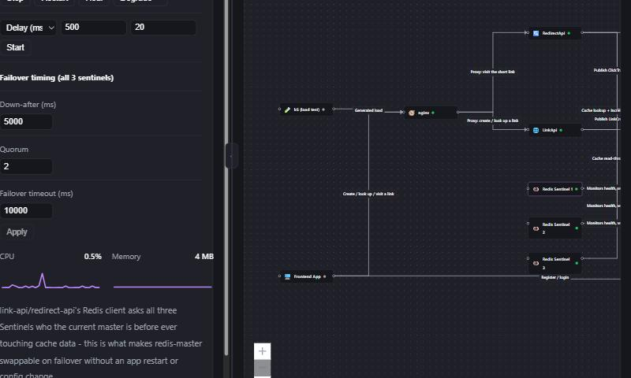

**Mongo (any of the 3 members)** — read preference for `traffic-service`'s reads only (writes
always go to whichever member is currently primary):

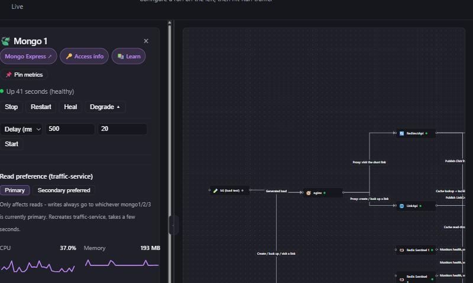

**Postgres replicas** — inject an artificial replication delay on one specific standby
(`ALTER SYSTEM SET recovery_min_apply_delay` + reload — no restart, independent per replica):

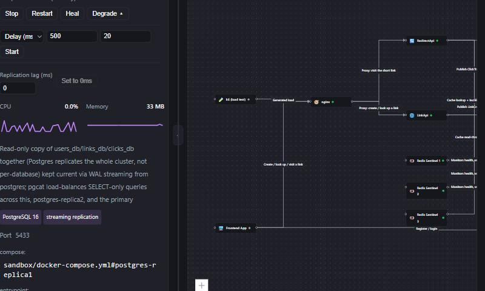

**Logical databases** (`users_db` / `links_db` / `clicks_db`) — a read-only live connection count
for that specific database:

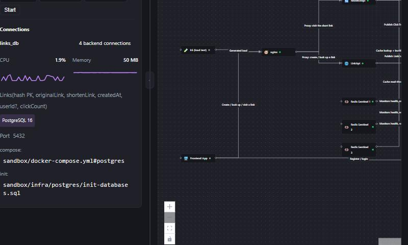

**RabbitMQ** — consumer prefetch (QoS), shared by `shortener-service` and `traffic-service`. Only
read once at consumer startup, so changing it recreates both services:

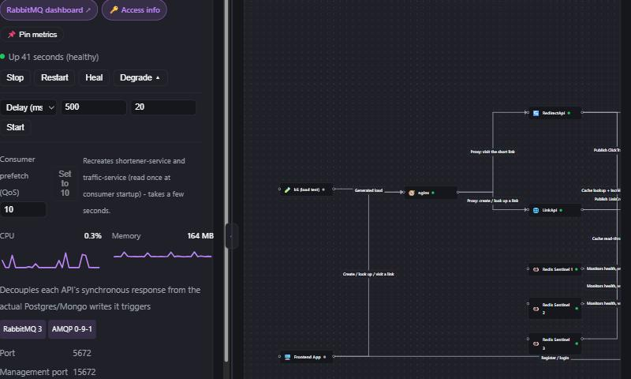

**nginx** — load-balancing toggle. Off routes k6's generated traffic straight to a single
link-api/redirect-api container, bypassing nginx (which keeps running regardless) — useful for
isolating "is nginx itself the bottleneck":

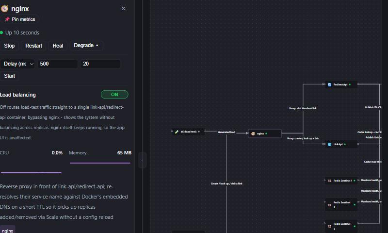

### 4.7 Connections (edges)

Click any edge in the graph to see what that connection actually is — its purpose, protocol,
payload format (when relevant), whether it's synchronous or asynchronous, and any extra note:

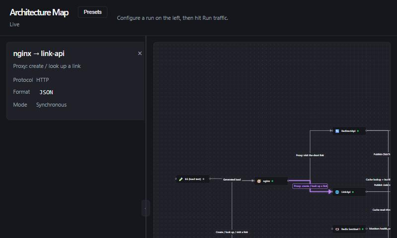

### 4.8 Access info and Learn

Every controllable node has two buttons next to its name. **Access info** opens a modal with
ready-to-copy connection details — host/port, a `psql`/`redis-cli`/etc. command, credentials, and a
full connection string, all dev-only values (never real secrets):

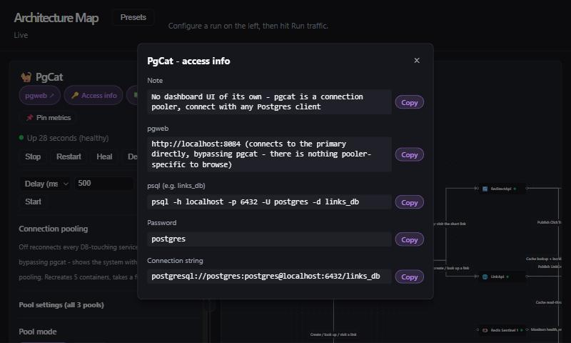

**Learn** opens a documentation panel rendered straight from the educational docs under
`sandbox/docs/scenarios/` — what the component solves, how it works, how it's actually configured,
and known pitfalls, each as an internal link you can click through to the full write-up:

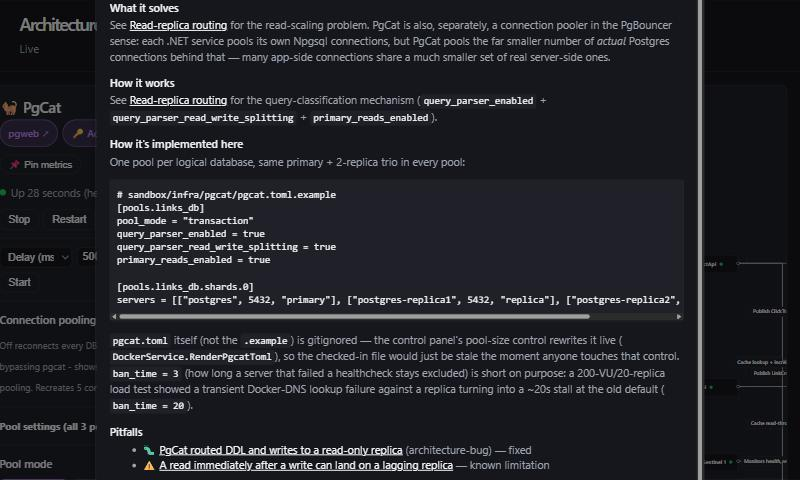

### 4.9 Pinned metrics

Clicking **Pin metrics** on any node panel adds that node's live CPU/RAM/connection numbers to a
small overlay panel fixed to the top-right of the graph canvas — independent of whatever you have
selected in the sidebar, so you can keep an eye on a handful of nodes while clicking around
elsewhere. Columns are click-to-sort; each row can be unpinned individually.

### 4.10 Load testing with k6

Click the **k6 (load test)** node to open its configuration panel. It isn't a real
docker-compose service with persistent state — it's a one-off container control-api spins up per
run — so selecting it only configures the *next* run, nothing live.

**What to call** — pick a service and one of its real endpoints, then **+ Add step** to append it
to an ordered sequence (order matters: a "Create link" step produces a hash a later "Resolve link"
step can consume). Each step gets a configurable pause-after and can be reordered or removed:

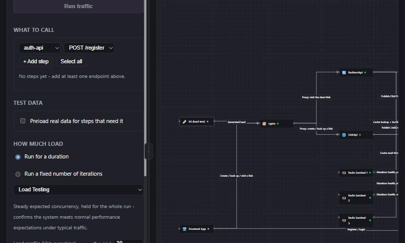

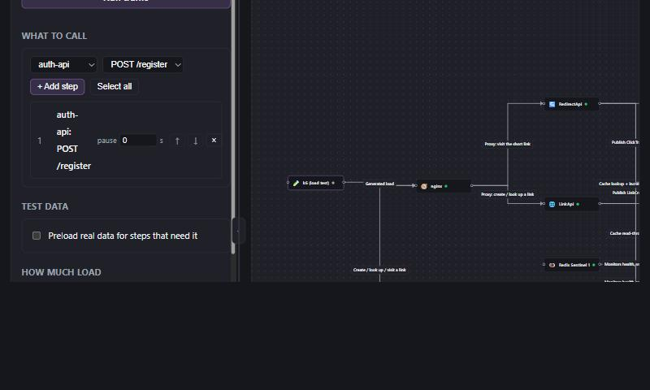

**Test data** — an opt-in "Preload real data for steps that need it." If your sequence has no
"Create" step of its own (e.g. you're only testing "Resolve link"), every iteration would otherwise
hit the same single fixture record; this preloads a configurable number of real records from the
live app first.

**How much load** — either run for a fixed duration (pick a ramp preset, then fine-tune it in an
interactive point graph: click empty space to add a ramp point, drag to reshape, double-click a
point to remove it) or run a fixed number of iterations regardless of elapsed time:

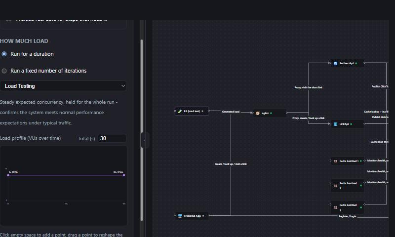

**Save this combination** — a **custom scenario** is simply this whole combination (sequence +
load shape + data-pool settings) saved under a name you can reload later. This is a different,
narrower concept than a **preset** (see [§4.12](#412-presets)), which snapshots the *infra*
configuration instead and can optionally link to one of these scenarios:

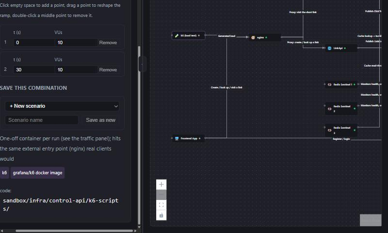

Hit **Run traffic**. While it runs, the header strip shows a live progress bar and charts (active
VUs, iterations/sec); **Cancel run** is available the whole time.

### 4.11 Run history, reuse, and compare

With nothing selected, the sidebar defaults to **run history** — every past run, newest first,
with its scenario name, timestamp, request count/rate, and failure count:

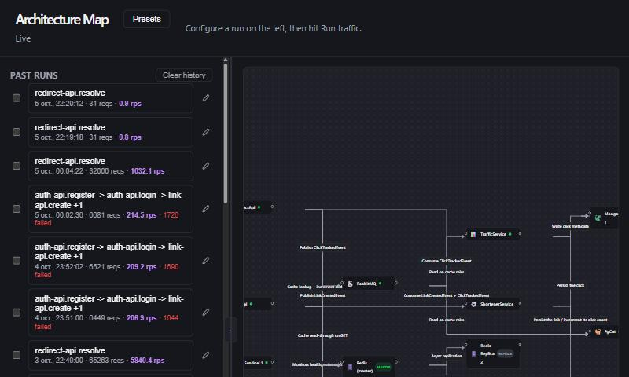

Opening one shows the full detail: its step sequence, the **infra configuration it ran under**
(load balancing/pooling/caching on/off, any non-default replica counts, PgCat pool settings,
Postgres connection counts at the time) — useful for understanding *why* two runs performed
differently — and a **Reuse config** button that reloads that run's sequence and ramp straight back
into the k6 panel and reapplies its infra settings:

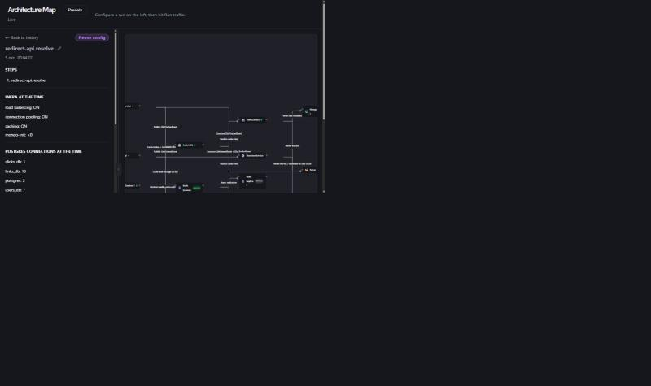

Below that is the full report: stat tiles, a latency breakdown, status codes per endpoint, the raw
k6 output, and — the most useful part for actually learning from a run — the **bottleneck panel**:

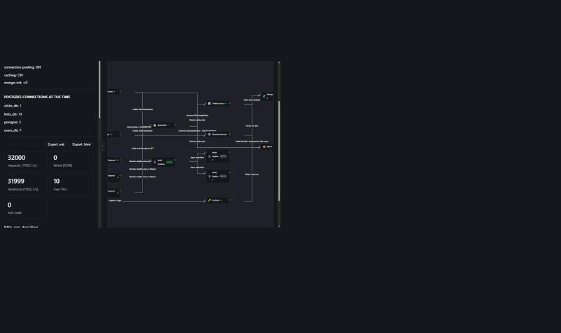

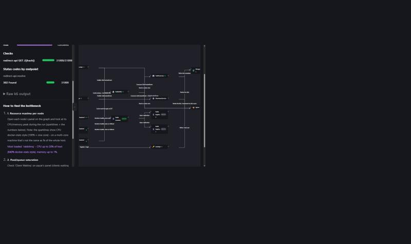

The bottleneck panel is deliberately two things at once: an always-open numbered checklist that
*teaches the diagnostic method* (resource usage per node, pool/queue saturation, trace hop
latency, ...), and a collapsed automatic verdict ranking suspect services with evidence — useful
once you already know roughly what to look for.

Select two or more runs with their checkboxes and hit **Compare** for a side-by-side table split
into Configuration and Results rows, with every differing value highlighted:

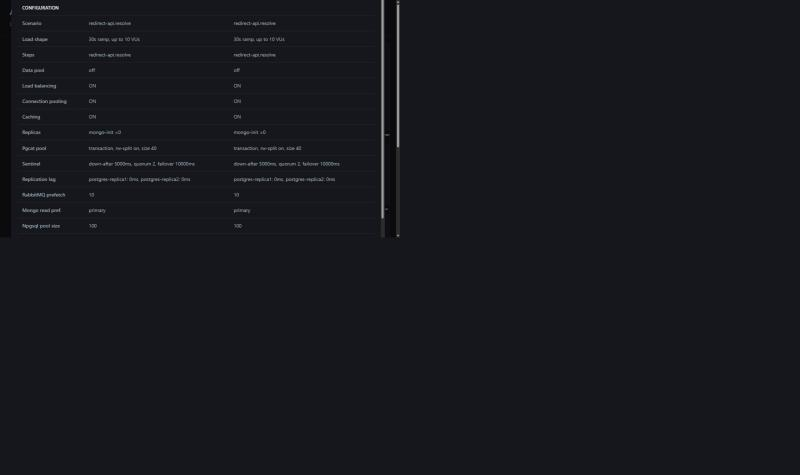

### 4.12 Presets

The header's **Presets** button is global, not tied to any node. A preset snapshots the *entire*
infra configuration (every toggle and pool setting above, replica counts, ...) under a name, and
optionally links to one custom scenario so applying it also loads that load profile:

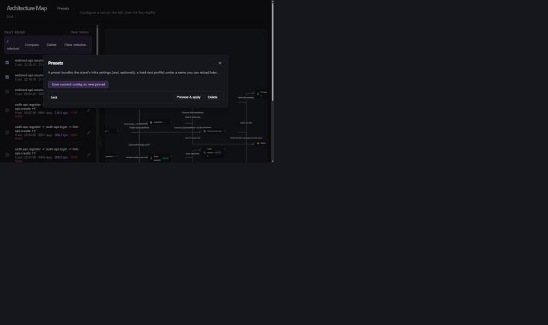

**Preview & apply** diffs the preset against the stand's current live configuration before doing
anything — nothing changes until you confirm:

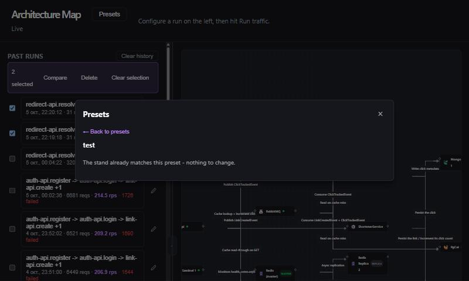

---

## 5. Infrastructure browser UIs

Each of these is a real third-party admin tool, wired up to point at the sandbox's own containers
— not built by this project, just configured for it.

**RabbitMQ management UI** (`:15672`, `guest`/`guest`) — overview with live message-rate graphs,
and a list of every real queue the application declares at connection time (not from a static
definitions file — see [`02-async.md`](scenarios/02-async.md)):

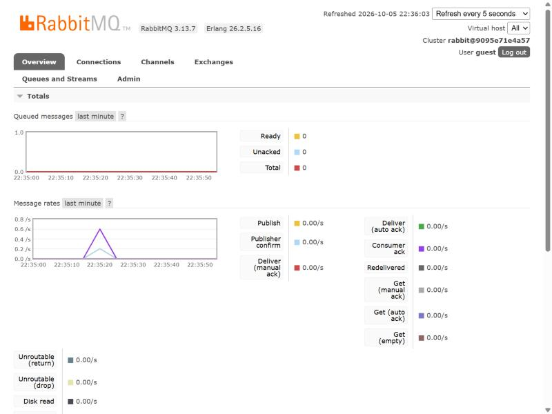

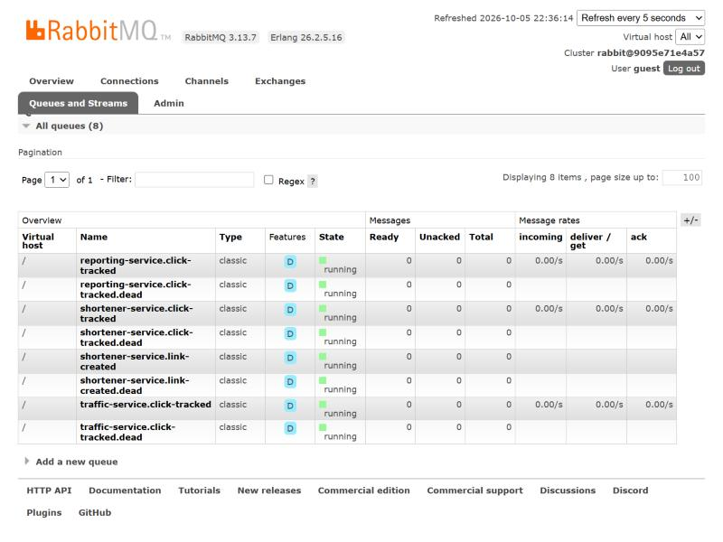

**pgweb** (`:8084`) — connects straight to the Postgres primary (not through PgCat — there's
nothing pooler-specific to browse), opened on `links_db` by default; switch databases from its own
connection screen:

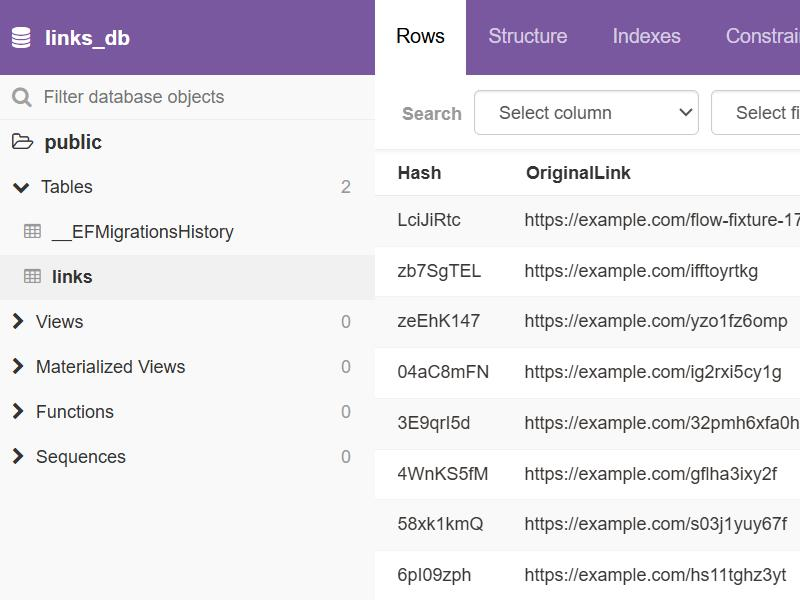

**RedisInsight** (`:5540`) — no database is pre-registered (it isn't Sentinel-aware, so point it at
whichever node is currently master — `redis-master`, port `6379` — and re-add if a real failover
promotes a different node):

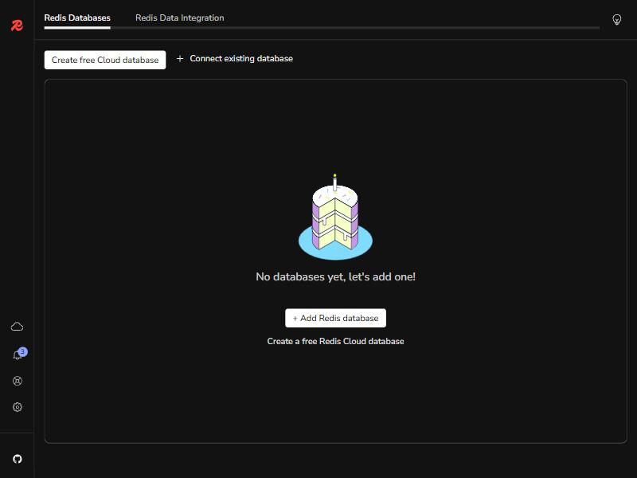

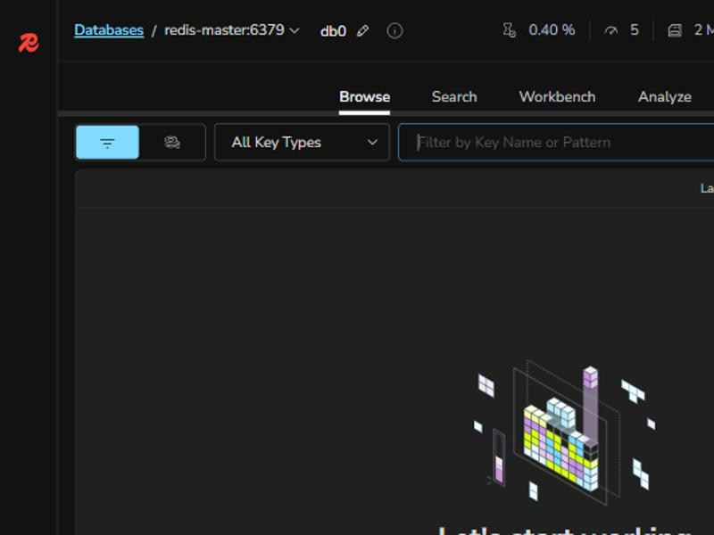

**Mongo Express** (`:8085`) — browse `clicks_meta_db`, including the actual click-metadata
documents TrafficService writes (parsed User-Agent, IP, geo):

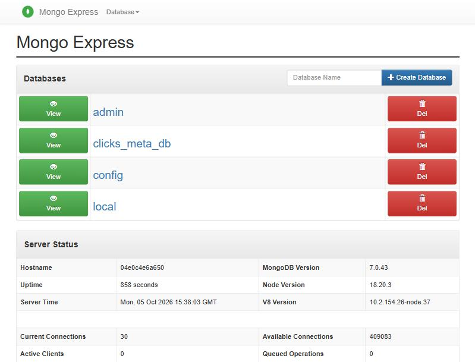

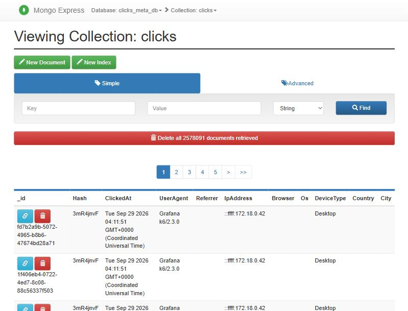

**sqlite-web fallback-queue viewers** (`:8086` LinkApi, `:8087` RedirectApi) — browse the local
SQLite file each API falls back to writing when RabbitMQ is briefly unreachable. Deliberately
**read-only** (`-r` flag plus a `:ro` volume mount, belt and suspenders): a fallback row deleted
through the viewer would be a message permanently lost, defeating the whole point of the
outage-recovery feature it's there to let you observe:

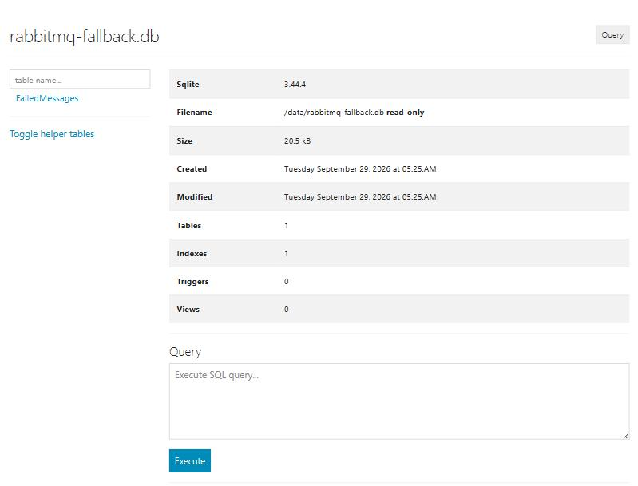

---

## 6. Observability

Every .NET service ships logs/metrics/traces (OpenTelemetry, OTLP) to a shared
`otel-collector`, which fans out differently depending on `-Observability`:

- **`Aspire`** (lightweight) — straight to a standalone Aspire Dashboard (`:18888`). Fine for
  everyday dev; its in-memory store isn't meant for load-test volume.
- **`Full`** (default, meant for load-test runs) — Prometheus + Jaeger + Loki + Grafana instead.
  Grafana ships three pre-provisioned dashboards (ASP.NET Core, Logs, Metrics, Traces) wired to
  those sources:

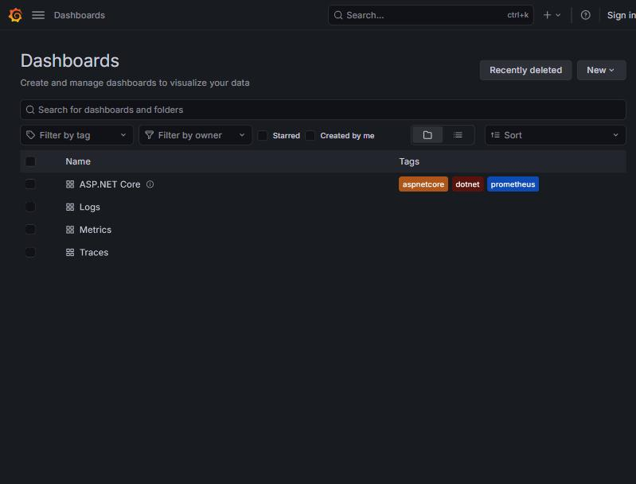

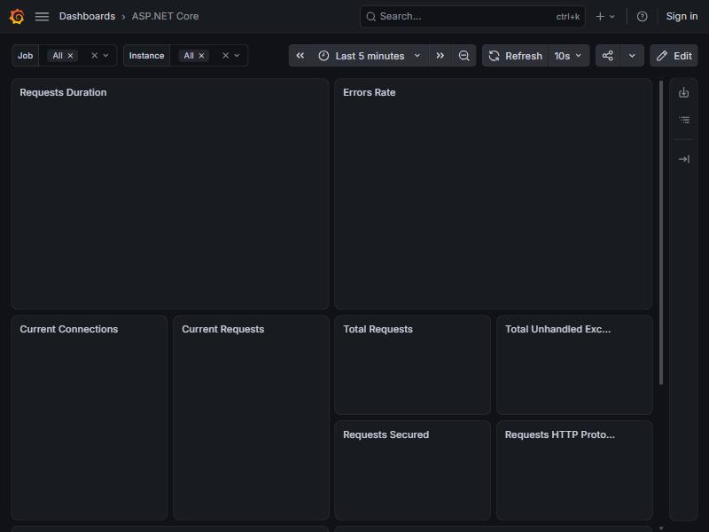

- **`None`** — services still run; they just drop their telemetry on the floor.

RabbitMQ publish/consume spans are hand-instrumented (no mainstream auto-instrumentation exists for
`RabbitMQ.Client`), so a single trace spans the async boundary end to end — one of the clearest
ways to actually *see* what "decoupled write path" means. Open **Jaeger** (`:16686`), search
service `LinkApi`, operation `POST Links`:

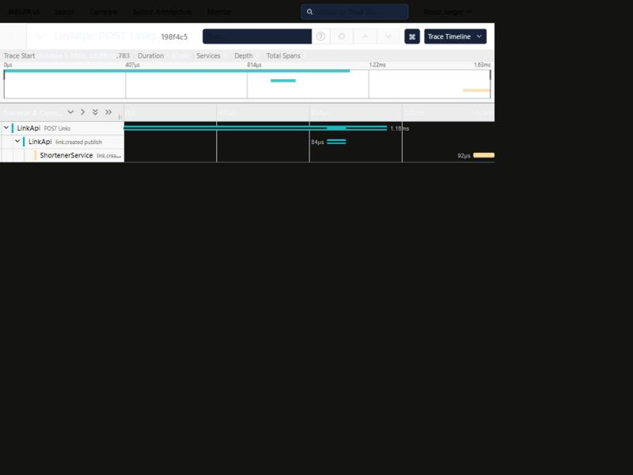

---

## 7. API docs (Scalar)

AuthApi, LinkApi, and RedirectApi each expose interactive API docs at `/scalar/v1` — every
endpoint, request/response shapes, and a built-in client to try requests directly from the browser
(curl, or a language of your choice):

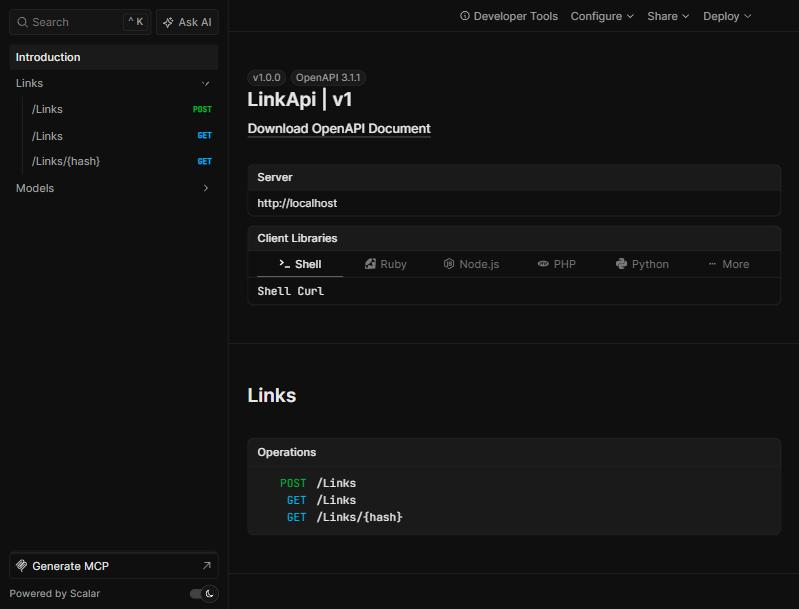

---

## 8. Database dump / restore

One pair of scripts per store this project writes to — same shape, same `sandbox/backups/` output
directory (gitignored), Linux/macOS `.sh` twins alongside every `.ps1` below.

```powershell
sandbox\scripts\dump-db.ps1                                   # -> sandbox/backups/postgres-<timestamp>.sql
sandbox\scripts\restore-db.ps1                                 # restores the newest file in sandbox/backups/
sandbox\scripts\restore-db.ps1 -DumpFile '.\sandbox\backups\postgres-20260918-120000.sql'

sandbox\scripts\dump-mongo.ps1                                 # -> sandbox/backups/mongo-<timestamp>.archive.gz
sandbox\scripts\restore-mongo.ps1

sandbox\scripts\dump-clickhouse.ps1                            # -> sandbox/backups/clickhouse-reports_db.clicks-<timestamp>.native
sandbox\scripts\restore-clickhouse.ps1

sandbox\scripts\dump-all.ps1                                   # runs all three dump-*.ps1 in sequence
sandbox\scripts\restore-all.ps1                                # runs all three restore-*.ps1 against the newest dump of each kind
```

`dump-db` runs `pg_dumpall` against the running `postgres` container — all three databases
(`users_db`/`links_db`/`clicks_db`) in one `.sql` file, for archiving or moving to another machine.
`restore-db` replays it against the `postgres` maintenance database (the dump already contains its
own `CREATE DATABASE` statements).

`dump-mongo`/`restore-mongo` use `mongodump`/`mongorestore --archive --gzip` against `clicks_meta_db`,
connected via the full `rs0` replica-set URI rather than straight to `mongo1` — Mongo can fail over
to any of the three nodes with zero involvement from this project (same as Redis Sentinel), so the
URI is what lets the driver find whichever node is actually primary right now instead of assuming
it's always `mongo1`.

`dump-clickhouse`/`restore-clickhouse` export/import `reports_db.clicks` in ClickHouse's own Native
format (`restore` `TRUNCATE`s the table first, a full replace rather than a merge on top of
whatever's already there).

---

## 9. A worked example, start to finish

A short loop that touches most of what's above:

1. `sandbox\scripts\start-stack.ps1` (defaults are fine).
2. In the product app (`:5173`), create a link and visit it a couple of times.
3. In architecture-map (`:5174`), click **RedirectApi** → **Access info**, or just watch the
   **Pin metrics** overlay react.
4. Open **Jaeger** (`:16686`) and find the trace for your request — see the full hop from
   `RedirectApi` through RabbitMQ to `TrafficService`.
5. Back in architecture-map, click **PgCat** → **Degrade** → Delay 500 ms, 30 s, **Start**.
6. Click the **k6** node, add a `redirect-api` → *Resolve link* step, enable **Preload real data**,
   run for a short duration.
7. Watch the live VUs/iterations chart, then open the finished report's **bottleneck panel** — with
   PgCat artificially slowed, the latency hop should point straight at it.
8. **Heal** PgCat, re-run the same scenario, and **Compare** the two runs.

---

## 10. Where to go next

- [`architecture.md`](architecture.md) — target end-state architecture and current implementation status.
- [`scenarios/`](scenarios/) — per-scenario deep dives (`01-minimal.md`, `02-async.md`, ...), plus
  `scenarios/nodes/` (per-component docs, the same content the **Learn** modal renders),
  `scenarios/patterns/`, and `scenarios/pitfalls/` (real bugs found and fixed, with before/after
  snippets).
- [`pgcat-pool-sizing.md`](pgcat-pool-sizing.md) — the reasoning behind PgCat's default pool sizes.
- [`adding-a-component.md`](adding-a-component.md) — how to add a new node or a new
  component-specific control to architecture-map yourself.
